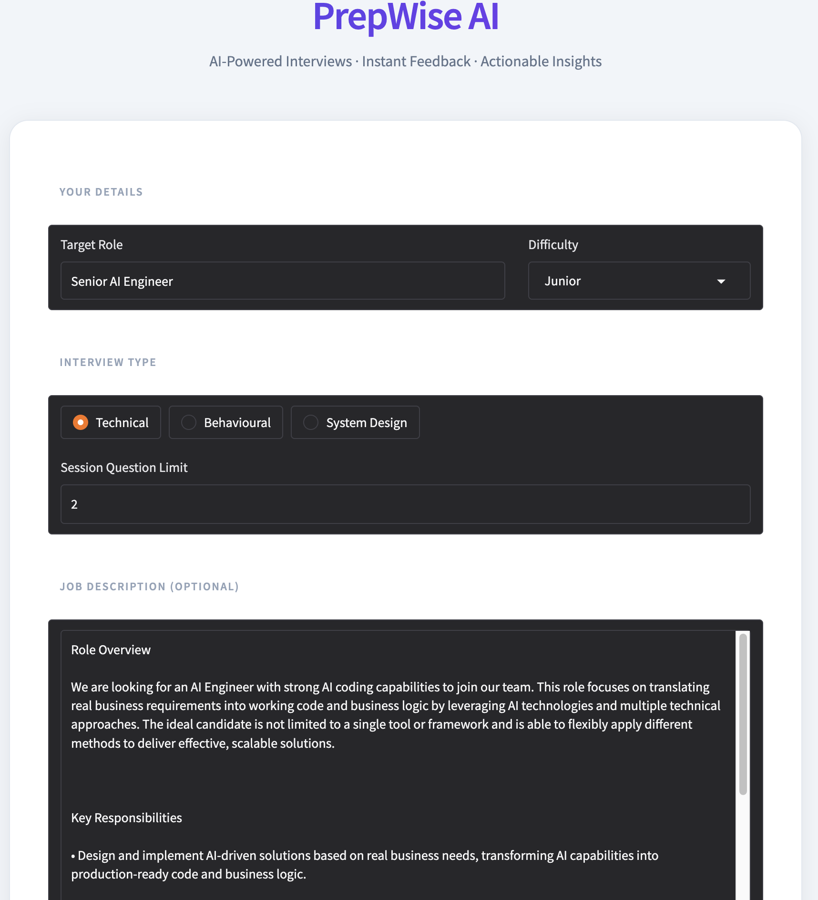
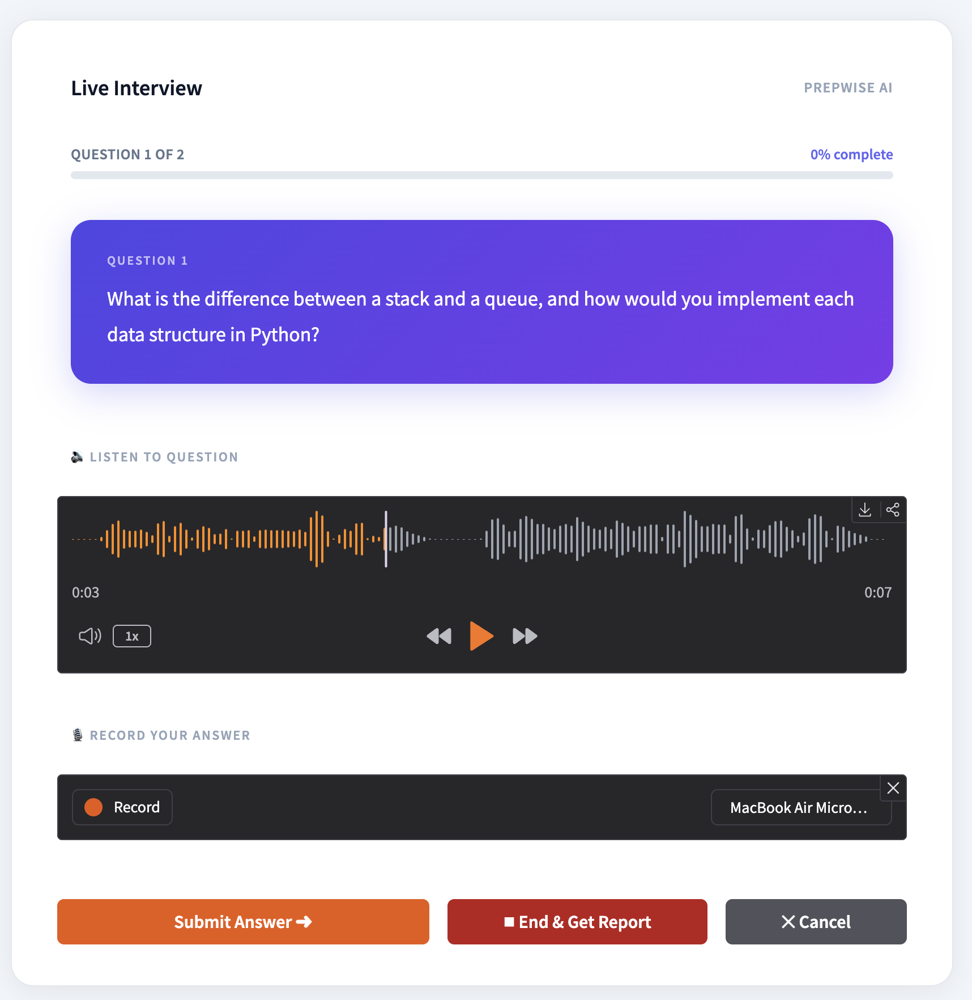
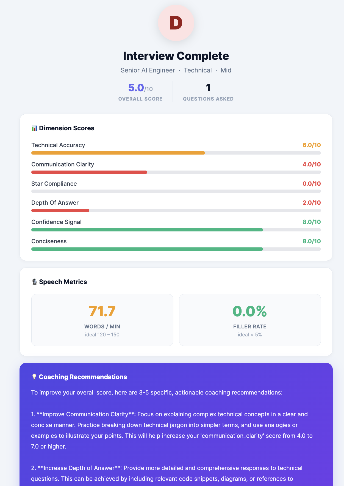
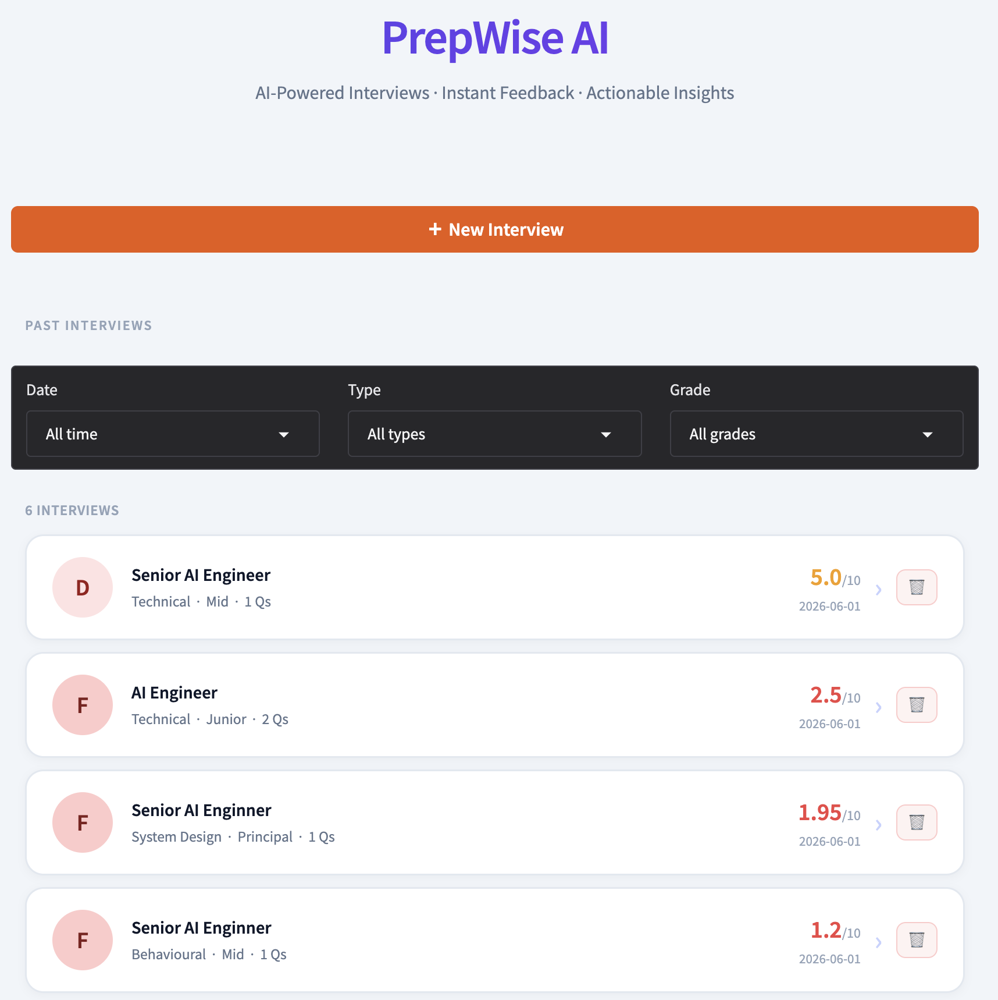

# PrepWise AI

> AI-Powered Interviews · Instant Feedback · Actionable Insights

A full-stack, agentic mock interview coach built to showcase applied skills in **LLM orchestration**, **Retrieval-Augmented Generation (RAG)**, and **Agentic AI system design**. Speak your answers, get real-time AI coaching, and receive a detailed performance report — all running locally.

---

## Screenshots

| Setup | Live Interview |
|---|---|
|  |  |

| Performance Report | Interview History |
|---|---|
|  |  |

---

## Features

- **Agentic Interviewer** — LangGraph-powered state machine that generates contextually relevant opening and follow-up questions; adapts based on your answers and enforces topic breadth across the session (covers diverse areas rather than drilling into one topic)
- **RAG Question Bank** — ChromaDB vector store pre-loaded with curated questions per interview type and difficulty; seeds LLM prompts with examples anchored to your target role and job description
- **Speech-to-Text** — Records spoken answers via microphone and transcribes with Groq Whisper (`whisper-large-v3`)
- **Text-to-Speech** — Questions read aloud via gTTS so the experience mirrors a real interview
- **Speech Metrics** — Measures words-per-minute and filler word rate alongside content quality
- **LLM Evaluator** — Scores every answer across 6 dimensions (technical accuracy, communication clarity, STAR compliance, depth, confidence, conciseness) with interview-type-specific weighting
- **Detailed Reports** — Dimension bar charts, per-question AI feedback, speech metrics, grade, and actionable coaching recommendations
- **Interview History** — Filterable (date range, type, grade) session history with click-to-view reports and per-session delete
- **Fully configurable** — Target role, interview type (Technical / Behavioural / System Design), difficulty (Junior → Principal), max questions per session, and optional job description for personalised questions
- **MLflow tracking** — Every session logged for experiment tracking and analysis
- **Dockerised** — Single `docker compose up` starts the full stack

---

## Architecture

```
┌──────────────────────────────────────────────────────────────┐
│                         Gradio UI                            │
│   Setup → Live Interview → Report   |   History              │
└───────────────────────┬──────────────────────────────────────┘
                        │ HTTP (httpx)
┌───────────────────────▼──────────────────────────────────────┐
│                      FastAPI Backend                          │
│  /session/create  /session/answer  /session/end              │
│  /session/transcribe  /sessions/list  /session/{id}/report   │
└───────┬──────────────────┬────────────────────┬──────────────┘
        │                  │                    │
┌───────▼───────┐  ┌───────▼────────┐  ┌────────▼───────┐
│  Interviewer  │  │   Evaluator    │  │    Speech      │
│    Agent      │  │    Agent       │  │    Agent       │
│  (LangGraph)  │  │ (LangChain +   │  │ Groq Whisper   │
│               │  │  Groq LLM)     │  │ + gTTS         │
│  Opening Q    │  │ Score answer   │  │ STT + TTS      │
│  Follow-up Q  │  │ Session report │  │ Speech metrics │
└───────┬───────┘  └────────────────┘  └────────────────┘
        │
┌───────▼──────────────────────────────────────────────────────┐
│                        RAG Pipeline                           │
│   ChromaDB  ·  SentenceTransformer (all-MiniLM-L6-v2)        │
│   Question bank (YAML → indexed by type + difficulty)        │
│   JD ingestion + per-question retrieval                       │
└──────────────────────────────────────────────────────────────┘
```

### Agentic Flow

1. **Session start** — Role, interview type, difficulty, max questions, and optional JD are sent to the API. The JD is chunked and stored in ChromaDB for per-question context retrieval.
2. **Opening question** — The Interviewer Agent retrieves seed questions from the vector store (filtered by type + difficulty, query enriched with role and JD snippet), then prompts Groq LLaMA to generate the opening question.
3. **Answer loop** — Each spoken answer is transcribed by Groq Whisper, scored by the Evaluator Agent across 6 dimensions, and the Interviewer Agent generates the next question. The agent follows a **1-follow-up rule**: it may probe deeper once if an answer is incomplete, but must switch to a new topic after 2 consecutive questions on the same subject.
4. **Session report** — After all questions are answered (or the user ends early), the Evaluator generates a full report with dimension averages, speech metrics, a grade, and coaching recommendations. The session is persisted as JSON and logged to MLflow.

---

## Tech Stack

| Concern | Tool |
|---|---|
| LLM | Groq API — `llama-3.3-70b-versatile` |
| Speech-to-Text | Groq Whisper — `whisper-large-v3` |
| Text-to-Speech | gTTS |
| Agent orchestration | LangGraph |
| LLM chaining | LangChain + LangChain-Groq |
| Vector store / RAG | ChromaDB + `all-MiniLM-L6-v2` |
| MLOps | MLflow |
| Backend | FastAPI |
| Frontend | Gradio 6 |
| Containers | Docker + Docker Compose |
| CI/CD | GitHub Actions |

---

## Prerequisites

- Python 3.11+
- A free **Groq API key** — get one at [console.groq.com](https://console.groq.com)
- `uv` package manager (recommended) or `pip`

---

## Local Setup

### 1. Clone the repo

```bash
git clone https://github.com/<your-username>/interview-agent.git
cd interview-agent
```

### 2. Create a virtual environment

```bash
# with uv (recommended)
curl -LsSf https://astral.sh/uv/install.sh | sh   # install uv if not already installed
uv venv
source .venv/bin/activate   # Windows: .venv\Scripts\activate

# or with plain Python
python -m venv .venv
source .venv/bin/activate
```

### 3. Install dependencies

```bash
# with uv
uv pip install -r requirements.txt

# or with pip
pip install -r requirements.txt
```

### 4. Configure environment

```bash
cp .env.example .env
```

Open `.env` and set your Groq API key:

```env
GROQ_API_KEY=gsk_...
```

### 5. Run

Open **two terminals** in the project root with the virtual environment activated.

**Terminal 1 — API:**
```bash
PYTHONPATH=. uvicorn api.main:app --host 0.0.0.0 --port 8000
```

**Terminal 2 — UI:**
```bash
PYTHONPATH=. python ui/app.py
```

Open **[http://localhost:7860](http://localhost:7860)** in your browser.

> `PYTHONPATH=.` is required because `config.py` lives at the project root and must be importable from all sub-packages.

---

## Docker Setup

The fastest way to get everything running:

```bash
cp .env.example .env      # set your GROQ_API_KEY inside
docker compose up --build
```

This starts:
- **PrepWise AI** — API on port `8000`, UI on port `7860`
- **MLflow** tracking server on port `5000`

---

## Running Tests

```bash
pytest tests/ -v
```

---

## Project Structure

```
interview-agent/
├── agents/
│   ├── interviewer_agent.py   # LangGraph agent: opening + follow-up question generation
│   ├── evaluator_agent.py     # Per-answer scoring + full session report generation
│   └── speech.py              # Groq Whisper STT + gTTS TTS + speech metrics
├── rag/
│   └── rag.py                 # ChromaDB question bank indexing + JD ingestion + retrieval
├── mlops/
│   └── tracker.py             # MLflow session logging
├── api/
│   └── main.py                # FastAPI: session lifecycle, transcription, report endpoints
├── ui/
│   ├── app.py                 # Gradio frontend: routing, event handlers
│   ├── templates.py           # HTML template functions
│   └── styles.css             # Custom CSS
├── data/
│   ├── question_bank/         # YAML question files (technical, behavioural, system_design)
│   ├── jd_uploads/            # Uploaded job descriptions
│   └── sessions/              # Persisted session JSON reports
├── tests/
│   └── test_core.py           # Pytest unit tests
├── config.py                  # Central config: paths, model names, scoring weights
├── requirements.txt
├── Dockerfile
├── docker-compose.yml
└── .env.example
```

---

## Key Design Decisions

**Why LangGraph for the interviewer?**
The interview is a stateful loop — opening question → answer → follow-up → answer → … → report. LangGraph's state machine makes transitions explicit and testable, and makes it straightforward to add new nodes (hint generation, topic routing, difficulty adaptation) without refactoring the core loop.

**Why RAG for question generation?**
Purely prompting the LLM to "ask a technical question" produces generic output. Seeding the prompt with questions retrieved from a curated, difficulty-filtered bank anchors the LLM to the right style, level, and domain — especially important for role-specific or JD-driven sessions.

**Why ChromaDB + SentenceTransformer locally?**
Zero latency, no external API calls for retrieval, and the question bank is small enough that a local vector store is the right tool. The same setup also handles JD chunking and per-question JD context retrieval within a session.

---

## Contributing

This is a personal portfolio project but issues and PRs are welcome.

---

## License

MIT
